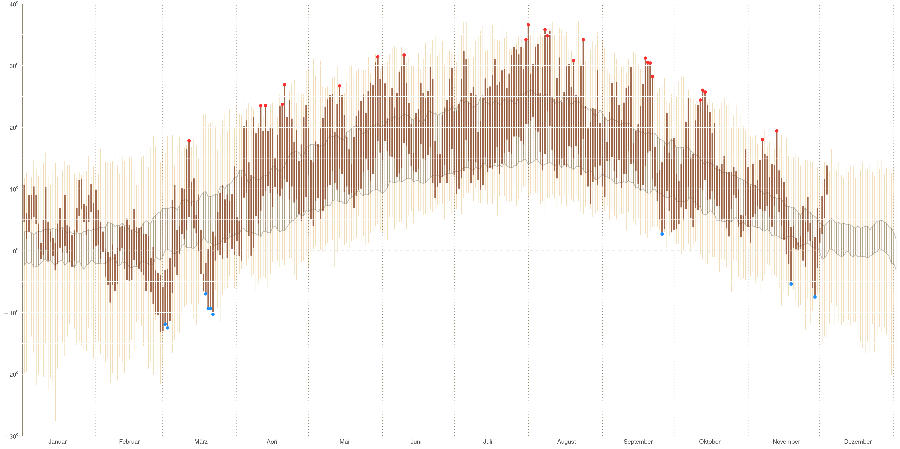
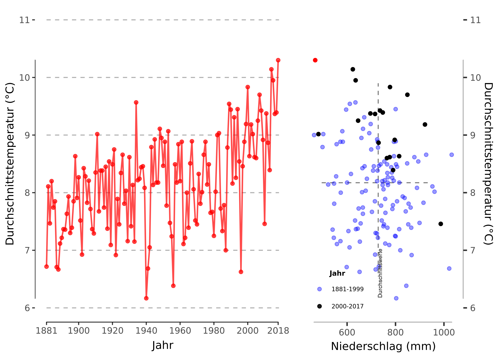
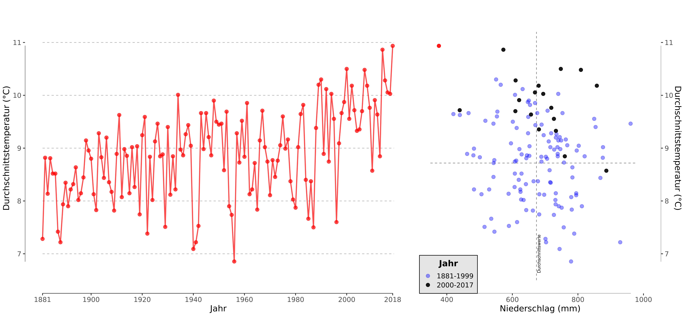
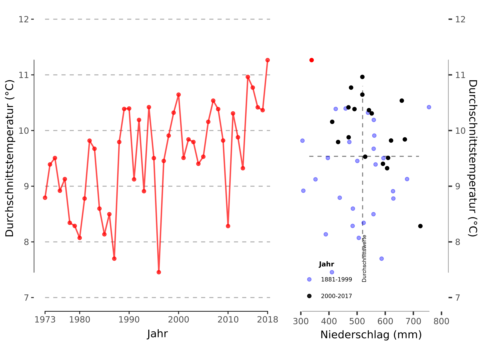
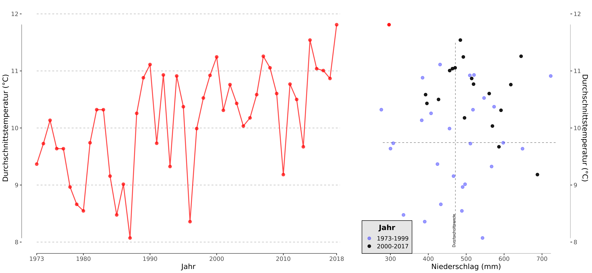

README
================

Visualizing the Weather and Climate (Change) in Leipzig
=======================================================

First Plot: 2018 Temperatur per Day
-----------------------------------

Inspiration: <https://rpubs.com/bradleyboehmke/weather_graphic>

Result:

Second and Third Plot: Temp & Precip over the years
---------------------------------------------------

Inspiration: <https://fivethirtyeight.com/features/why-californias-wildfires-are-so-destructive-in-5-charts/>

The German Weather Service has monthly data of Regional Averages for Saxony that go back to the year 1881. I calculated yearly averages with these monthly values for all years till 2018. December is always excluded as it has not happened yet.

<!---

-->
Daily Averages for **Leipzig** are available only since 1973. If we use this shorter but more precise data set the graphs look like this

<!---

-->
Data Sources
------------

[Deutscher Wetterdienst](ftp://ftp-cdc.dwd.de/pub/CDC/)
