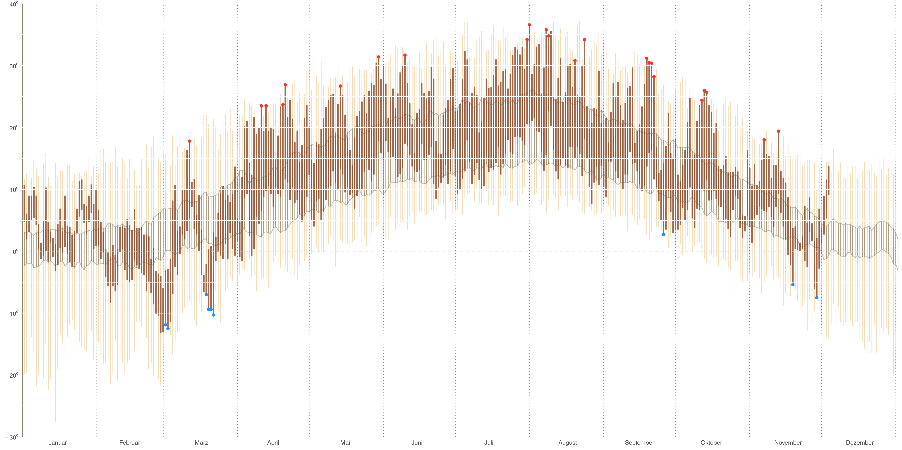
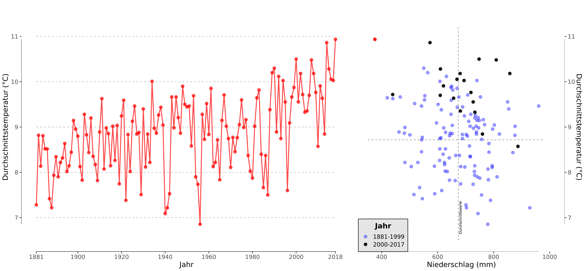

```{r prep, message=FALSE, warning=FALSE, include=FALSE, paged.print=FALSE}
library(Cairo)
library(patchwork)
save.plot <- FALSE
```


# Visualizing the Weather and Climate (Change) in Leipzig

## First Plot: 2018 Temperatur per Day

Inspiration: https://rpubs.com/bradleyboehmke/weather_graphic

Result: 



## Second and Third Plot: Temp & Precip over the years 

Inspiration: https://fivethirtyeight.com/features/why-californias-wildfires-are-so-destructive-in-5-charts/

The German Weather Service has monthly data of Regional Averages for Saxony that go back to the year 1881. I calculated yearly averages with these monthly values for all years till 2018. December is always excluded as it has not happened yet.

```{r regioPlot, echo=FALSE, message=FALSE, warning=FALSE, paged.print=FALSE, out.width="100%", dpi = 400}
source("makeRegioPlot.R")
regioPlot <- regioTemp + regioPrecip + plot_layout(ncol = 2, widths = c(1.6, 1))
print(regioPlot)
if (save.plot) {
    # Save it cairo pdf
    ggsave(regioPlot, filename = paste0("plots/regio_", gsub("[^[:alnum:]=\\.]", "", lubridate::now()), ".pdf"), 
        device = cairo_pdf, width = 270, height = 125, units = "mm", scale = 1.7, limitsize = FALSE)
}
```

<!---

-->

Daily Averages for **Leipzig** are available only since 1973. If we use this shorter but more precise data set the graphs look like this

```{r dailyPlot, echo=FALSE, message=FALSE, warning=FALSE, paged.print=FALSE, out.width="100%", dpi = 400}
source("makeDailyPlot.R")
dailyPlot <- dailyTemp + dailyPrecip + plot_layout(ncol = 2, widths = c(1.6, 1))
print(dailyPlot)
if (save.plot) {
    # Save it cairo pdf
    ggsave(dailyPlot, filename = paste0("plots/daily_", gsub("[^[:alnum:]=\\.]", "", lubridate::now()), ".pdf"), 
        device = cairo_pdf, width = 270, height = 125, units = "mm", scale = 1.7, limitsize = FALSE)
}
```


<!---

-->

## Data Sources

[Deutscher Wetterdienst](ftp://ftp-cdc.dwd.de/pub/CDC/)